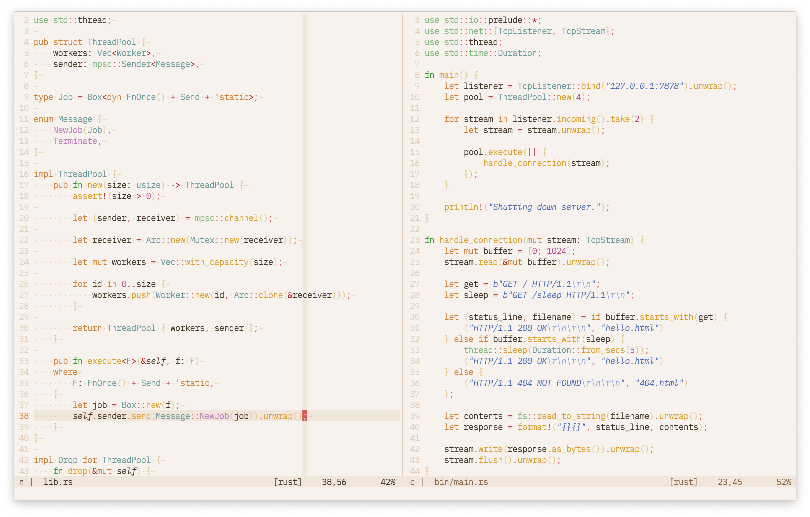

## Features
- Works with Neovim stable and Vim 8
- Dark and light variants
- Support for:
  - LSP
  - [nvim-treesitter](https://github.com/nvim-treesitter/nvim-treesitter)
  - [VimTeX](https://github.com/lervag/vimtex)
- Support for various terminal emulators:
  - [Alacritty](https://github.com/alacritty/alacritty)
  - [iTerm2](https://github.com/gnachman/iTerm2)
  - [Kitty](https://github.com/kovidgoyal/kitty)
  - [Wezterm](https://github.com/wez/wezterm)


## Requirements
* A terminal or GUI with true color and font variants support (italics, bold, etc).
* `termguicolors` enabled


## Installation
You can install Melange with any Neovim/Vim plugin manager.
For example, with [Packer](https://github.com/wbthomason/packer.nvim):

```lua
use "savq/melange";
```

Additionally, [nvim-treesitter](https://github.com/nvim-treesitter/nvim-treesitter)
can be used to install tree-sitter parsers,
and [Lush.nvim](https://github.com/rktjmp/lush.nvim)
can be used to extend the colorscheme (see [Contributing](./CONTRIBUTING.md)).


## Usage
Enable `termguicolors` and load the `colorscheme`.

In your `init.vim`:
```vim
set termguicolors
colorscheme melange
```

Or in your `init.lua`:
```lua
vim.opt.termguicolors = true
vim.cmd("colorscheme melange")
```

To enable the light variant, set the `background` (or let your terminal do it for you)
before setting the colorscheme.


## Design
Melange was developed with the following ideas in mind:

* _Control flow_ should use warmer colors and _data_ should use colder colors.
* No configuration. It's open source, fork it if you don't like something.
* Ayu and Gruvbox were the main inspirations.


## Previews




The font is [IBM/plex](https://github.com/IBM/plex) Mono Light
