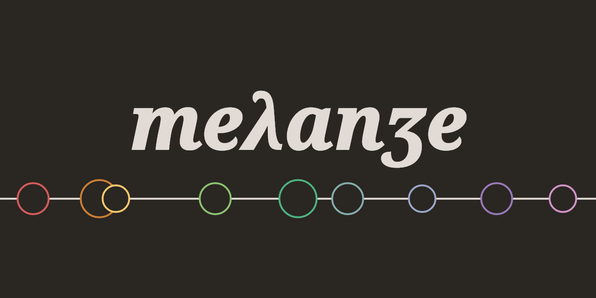

🚧 **WORK IN PROGRESS. See [TODO](TODO.md)** 🚧



Melange is a dark color scheme with a warm, moderate contrast color palette.
It supports tree-sitter and regular highlighting (works with Vim8).


### Requirements

* `termguicolors` enabled for true color support

* (recommended) Neovim 0.5
* (recommended) [nvim-treesitter](https://github.com/nvim-treesitter/nvim-treesitter)


### Installation

With [Paq](https://github.com/savq/paq-nvim):

```lua
paq 'savq/melange'
```

With [Packer](https://github.com/wbthomason/packer.nvim):

```lua
use 'savq/melange'
```

Additionally, [nvim-treesitter](https://github.com/nvim-treesitter/nvim-treesitter)
can be used to install tree-sitter grammars.


### Usage

In your `init.vim`:
```vim
colorscheme melange
```

Or in your `init.lua`:
```lua
vim.cmd 'colorscheme melange'
```


### Design

The color scheme was developed with the following ideas in mind:

* Control flow should use warmer colors
* Data should use colder colors
* It should be easy to modify
* Ayu and Gruvbox were the main inspirations


### Build and develop

Melange is made with [Lush.nvim](https://github.com/rktjmp/lush.nvim),
which makes it very easy to modify.

Assuming you have Lush.nvim installed, you can change the definitions in
`lua/melange/colors.lua`, live preview them, and when you're happy with them
compile them to a `.vim` file. Melange provides a build script and a makefile
for convenience.

Alternatively, you can source the `.lua` file directly:

```lua
lua require('lush')(require('melange.colors'))
```


### Contributing

I'm open to suggestions on the color scheme, there are still things that
I don't find perfect just yet.

Highlight group definitions for specific languages won't be accepted though.
Your favorite language probably has a tree-sitter grammar already available.
See the [supported languages](https://github.com/nvim-treesitter/nvim-treesitter#supported-languages).

It's possible to auto-generate colors schemes for different terminal emulators.
Although, only [Alacritty](https://github.com/alacritty/alacritty) is currently available.
If you want to add support for another terminal emulator, feel free to open a PR.

Support for status line plugins would also be welcome
(the lush templates have some info on that).

### Preview


