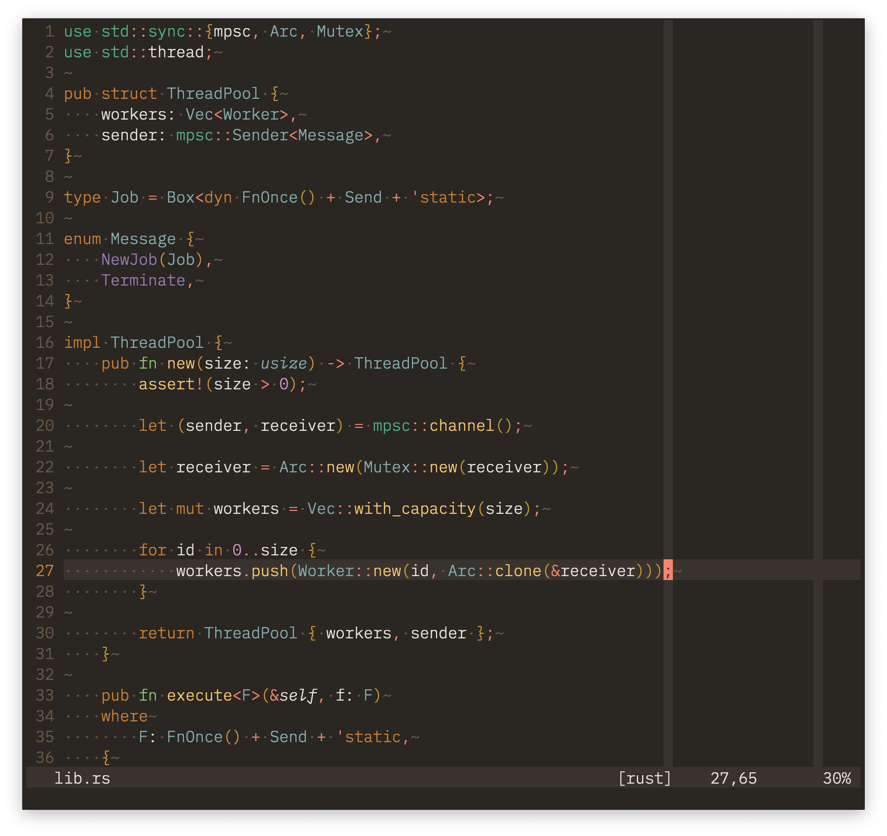

🚧 **WORK IN PROGRESS. See [TODO](TODO.md)** 🚧

## Features
- Works with Neovim and Vim
- tree-sitter support
- Dark and light variants
- Support for various terminal emulators:
  - [Alacritty](https://github.com/alacritty/alacritty)
  - [iTerm2](https://github.com/gnachman/iTerm2)
  - [Kitty](https://github.com/kovidgoyal/kitty)


## Requirements
* `termguicolors` enabled for true color support
* Neovim 0.5 (recommended)
* [nvim-treesitter](https://github.com/nvim-treesitter/nvim-treesitter) (recommended)


## Installation
With [Paq](https://github.com/savq/paq-nvim):
```lua
paq 'savq/melange'
```

With [Packer](https://github.com/wbthomason/packer.nvim):
```lua
use 'savq/melange'
```

Additionally, [nvim-treesitter](https://github.com/nvim-treesitter/nvim-treesitter)
can be used to install tree-sitter grammars.


## Usage

Set the `colorscheme` option. If you want to enable the light variant, set the `background` before setting the colorscheme.

In your `init.vim`:
```vim
"set background=light
colorscheme melange
```

Or in your `init.lua`:
```lua
--vim.o.background = 'light'
vim.cmd 'colorscheme melange'
```


## Design

The color scheme was developed with the following ideas in mind:

* Control flow should use warmer colors
* Data should use colder colors
* It should be easy to modify
* Ayu and Gruvbox were the main inspirations


## Build and develop

Melange is made with [Lush.nvim](https://github.com/rktjmp/lush.nvim),
which makes it very easy to modify.

Assuming you have Lush.nvim installed, you can change the definitions in
`lua/melange/colors.lua`, live preview them, and when you're happy with them
compile them to a `.vim` file. Melange provides a build script and a makefile
for convenience.

Alternatively, you can source the `.lua` file directly:

```lua
lua require('lush')(require('melange.colors'))
```


## Contributing

I'm open to suggestions on the color scheme, there are still things that
I don't find perfect just yet.

Support for plugins, status-lines and the like are welcome.

Highlight group definitions for specific languages won't be accepted though.
Your favorite language probably has a tree-sitter grammar already available.
See the [supported languages](https://github.com/nvim-treesitter/nvim-treesitter#supported-languages).

It's possible to auto-generate colors schemes for different terminal emulators.
If you want to add support for another terminal emulator, feel free to open a PR.


## Preview


